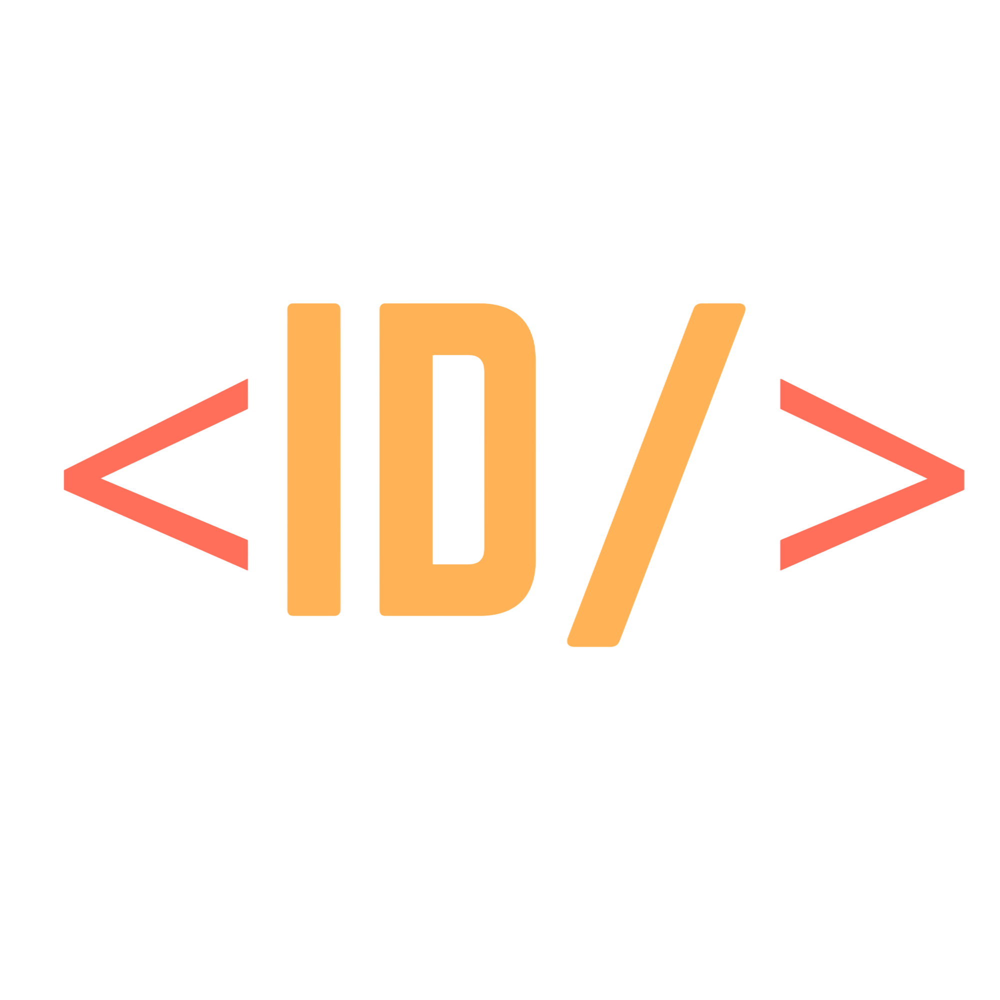

# Interview Diaries - Where Developers Share Their Interview Stories

Use Interview Diaries here on [Live Link](https://interview-diaries.vercel.app)

Watch Demo Video on [loom](https://www.loom.com/share/d89eb529a83246f18262b425056d077f?sid=2f3b0579-14ee-46c4-a542-0c384c828d5f)

> Winner of Webdecoded Hackathon

## Table of contents

- [Overview](#overview)
- [Screenshots](#screenshots)
- [Built with](#built-with)
- [Challenges Faced](#challenges-faced)
- [Future Enhancements](#features-i-would-like-to-implement-in-the-future)
- [Run the project](#run-the-project)
- [Thank you note](#thank-you)

## Overview

- Interview Diaries is a user-friendly blogging platform designed for developers to effortlessly share their interview experiences.
- Other developers can read these interview experiences to gain insights and better prepare for their upcoming interviews.
- The dedicated blog section displays all available articles and includes a search bar, allowing users to easily find articles related to the companies they are interested in.
- Reading articles does not necessitate user login. Users can freely access articles, each of which includes information about the company name, position, difficulty level, and whether the author was selected for the role or not.
- You can also play the article. Just hit the play button and listen to it.
- Additionally, you have the option to leave comments on the articles, which does require you to log in.
- We also offer a newsletter that you can subscribe to by providing your email address.
- Writing an interview experience blog does require you to log in.
- You can log in using your Apple ID, Facebook, GitHub, Google, or traditional email and password.
- Once you are logged in, you can write articles. The platform supports familiar Markdown, which you can use to compose your articles. The preview panel will display how your article will appear.
- In the blog section, you can view all the available articles on the platform in either a card view or table view.
- When you log in, you can also access your dashboard where you can view all the articles published by you and have the option to delete them as well.
- The platform is fully responsive, whether you use it on a desktop, tablet, or mobile phone.
- It offers support for both dark and light modes.

## Screenshots


## Built with

- Nextjs 13
- React
- NextUI
- Tailwind CSS
- Typescript
- Clerk for auth
- Firebase for database
- react-markdown
- react-toastify

## Challenges Faced

- As a Mobile Developer I work with with React Native and React. I had awareness of Next.js but hadn't previously built a project with it, so I had to adapt to it.
- I had previous experience with Tailwind CSS when it was relatively new, but I hadn't used it extensively in a larger project, so I had to spend some time familiarizing myself with it.

## Features I would like to implement in the future

- Enhance the author profile by incorporating reputation points, similar to the system used on Stack Overflow.
- Incorporate ChatGPT AI to provide authors with suggestions while they are writing.
- Enable users to express reactions on the articles.
- Develop a mobile app for it using React Native.

## Run the project

Clone this repo and open in VSCode or any code editor of your choice. Open Terminal and type this command to install all the dependencies.

```
npm i
```

Now you need to set environment variables. Create .env file in the root of your project directory.

Now Go to [clerk website](https://clerk.com) and create an account to add authentication in the app.
Copy this variables from your account and paste it in .env file.

```
NEXT_PUBLIC_CLERK_PUBLISHABLE_KEY=
CLERK_SECRET_KEY=
```

Now go to [firebase website](https://firebase.google.com) and create a project and add a firestore database.
Copy this variables from your account and paste it in .env file.

```
NEXT_PUBLIC_API_KEY=
NEXT_PUBLIC_AUTH_DOMAIN=
NEXT_PUBLIC_PROJECT_ID=
NEXT_PUBLIC_STORAGE_BUCKET=
NEXT_PUBLIC_MESSAGING_SENDER_ID=
NEXT_PUBLIC_APP_ID=
```

Now to run the app, run this command.

```
npm start
```

Now you can view this app on your browser.

## Thank You

A heartfelt thank you for hosting the hackathon. I learned so much and thoroughly enjoyed it.
